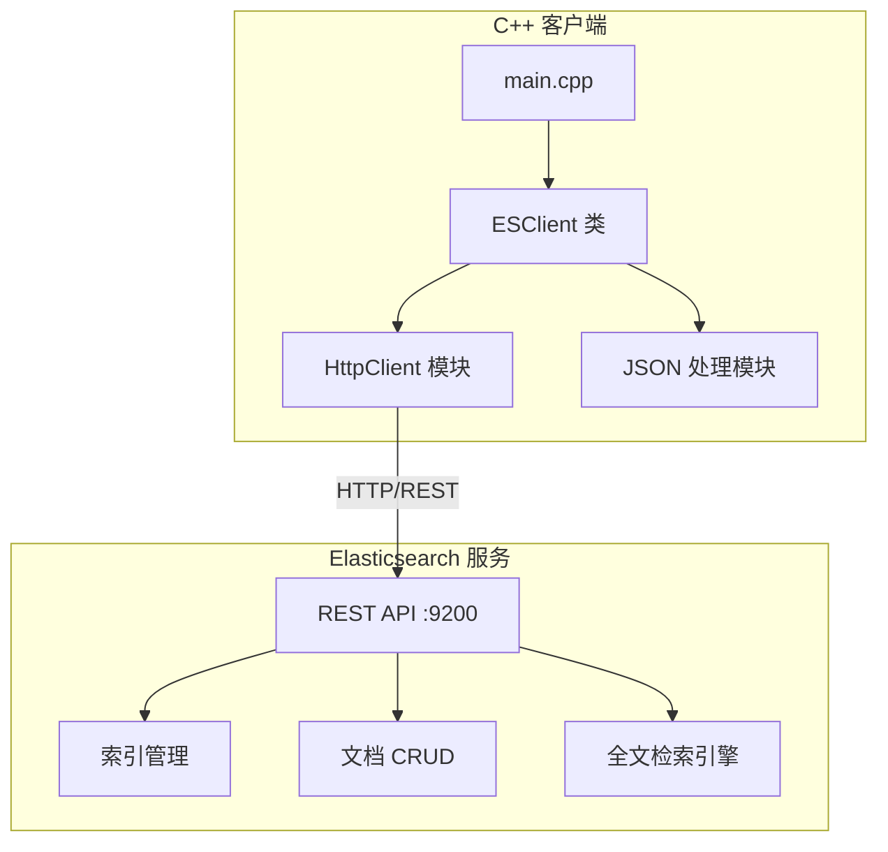
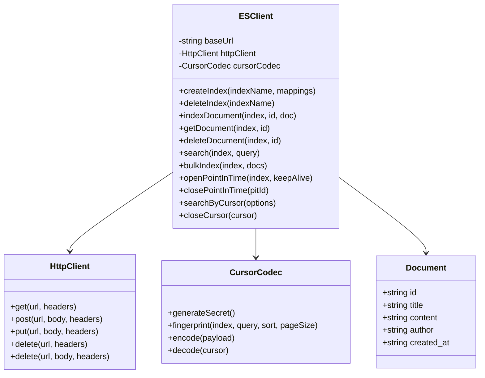

# Elasticsearch 全文检索 C++ 示例项目设计

## 1. 系统架构



## 2. 模块设计



## 3. 功能清单

| 功能模块 | 功能点     | 说明                           |
| -------- | ---------- | ------------------------------ |
| 索引管理 | 创建索引   | 支持自定义 mapping 和 settings |
| 索引管理 | 删除索引   | 删除指定索引                   |
| 索引管理 | 查看索引   | 获取索引信息                   |
| 文档操作 | 添加文档   | 单条/批量添加                  |
| 文档操作 | 获取文档   | 根据 ID 获取                   |
| 文档操作 | 更新文档   | 更新指定文档                   |
| 文档操作 | 删除文档   | 删除指定文档                   |
| 全文检索 | Match 查询 | 分词匹配查询                   |
| 全文检索 | Term 查询  | 精确匹配查询                   |
| 全文检索 | Bool 查询  | 组合条件查询                   |
| 全文检索 | 高亮显示   | 搜索结果高亮                   |
| 全文检索 | 分页查询   | 支持 from/size                 |
| 游标分页 | 建立快照   | 首次请求创建 PIT 并返回游标    |
| 游标分页 | 稳定翻页   | search_after 前进，快照隔离并发写入 |
| 游标分页 | 游标安全   | HMAC 签名 + 检索参数指纹绑定   |
| 游标分页 | 资源管理   | 末页/主动关闭 PIT，keep_alive 兜底回收 |

## 4. API 接口设计

### 4.1 索引管理

- `PUT /{index}` - 创建索引
- `DELETE /{index}` - 删除索引
- `GET /{index}` - 获取索引信息

### 4.2 文档操作

- `POST /{index}/_doc/{id}` - 添加/更新文档
- `GET /{index}/_doc/{id}` - 获取文档
- `DELETE /{index}/_doc/{id}` - 删除文档
- `POST /{index}/_bulk` - 批量操作

### 4.3 搜索接口

- `POST /{index}/_search` - 搜索文档

### 4.4 游标分页（Point in Time）

- `POST /{index}/_pit?keep_alive=...` - 建立 PIT 快照
- `POST /_search`（body 携带 `pit`、`search_after`）- 沿快照翻页
- `DELETE /_pit`（body 携带 `id`）- 关闭 PIT 快照

游标为不透明字符串，格式 `esc1.<base64url(payload)>.<base64url(hmac)>`，
payload 包含 PIT id、search_after 排序值、检索参数指纹与过期时间；
签名密钥由客户端实例持有（默认随机生成，可通过 `setCursorSecret` 指定
以实现跨进程验证）。

## 5. 技术选型

| 组件        | 技术          | 版本  |
| ----------- | ------------- | ----- |
| 编程语言    | C++           | 17    |
| HTTP 客户端 | libcurl       | 7.x   |
| JSON 库     | nlohmann/json | 3.x   |
| 搜索引擎    | Elasticsearch | 8.x   |
| 构建工具    | CMake         | 3.16+ |
| 容器化      | Docker        | 20.x  |

## 6. 目录结构

```
es-cpp-demo/
├── backend/
│   ├── CMakeLists.txt
│   ├── Dockerfile
│   ├── include/
│   │   ├── es_client.hpp
│   │   ├── es_cursor.hpp
│   │   ├── http_client.hpp
│   │   └── json.hpp
│   ├── src/
│   │   ├── main.cpp
│   │   ├── es_client.cpp
│   │   ├── es_cursor.cpp
│   │   └── http_client.cpp
│   ├── test/
│   │   └── cursor_test.cpp
│   └── data/
│       └── sample_data.json
├── docker-compose.yml
├── .gitignore
├── README.md
└── docs/
    └── project_design.md
```
