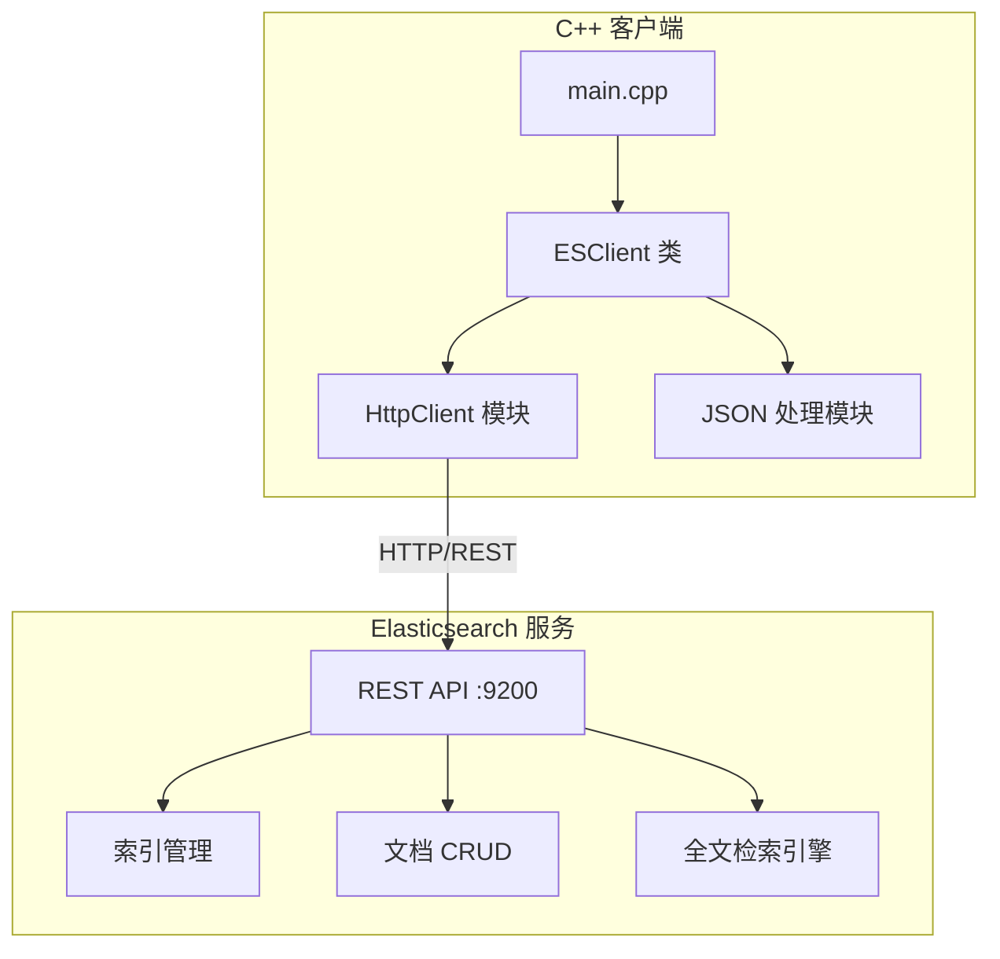
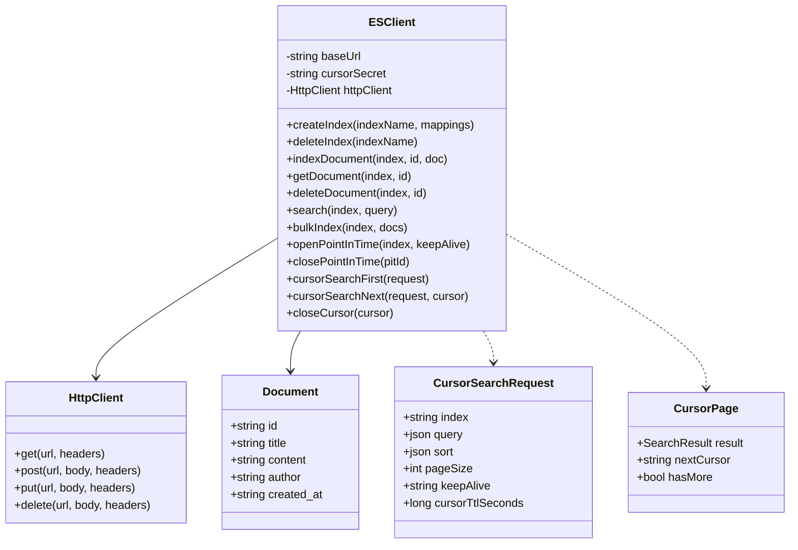

# Elasticsearch 全文检索 C++ 示例项目设计

## 1. 系统架构



## 2. 模块设计



## 3. 功能清单

| 功能模块 | 功能点     | 说明                           |
| -------- | ---------- | ------------------------------ |
| 索引管理 | 创建索引   | 支持自定义 mapping 和 settings |
| 索引管理 | 删除索引   | 删除指定索引                   |
| 索引管理 | 查看索引   | 获取索引信息                   |
| 文档操作 | 添加文档   | 单条/批量添加                  |
| 文档操作 | 获取文档   | 根据 ID 获取                   |
| 文档操作 | 更新文档   | 更新指定文档                   |
| 文档操作 | 删除文档   | 删除指定文档                   |
| 全文检索 | Match 查询 | 分词匹配查询                   |
| 全文检索 | Term 查询  | 精确匹配查询                   |
| 全文检索 | Bool 查询  | 组合条件查询                   |
| 全文检索 | 高亮显示   | 搜索结果高亮                   |
| 全文检索 | 分页查询   | 支持 from/size                 |
| 游标分页 | 建立快照   | 首次请求建立 PIT 并返回首页    |
| 游标分页 | 稳定翻页   | search_after 前进，快照隔离增删 |
| 游标分页 | 确定次序   | 自动追加 _shard_doc 决胜键     |
| 游标分页 | 游标安全   | HMAC 签名 + 条件绑定 + 有效期  |
| 游标分页 | 资源回收   | 末页/主动关闭 PIT，超时自回收  |

## 4. API 接口设计

### 4.1 索引管理

- `PUT /{index}` - 创建索引
- `DELETE /{index}` - 删除索引
- `GET /{index}` - 获取索引信息

### 4.2 文档操作

- `POST /{index}/_doc/{id}` - 添加/更新文档
- `GET /{index}/_doc/{id}` - 获取文档
- `DELETE /{index}/_doc/{id}` - 删除文档
- `POST /{index}/_bulk` - 批量操作

### 4.3 搜索接口

- `POST /{index}/_search` - 搜索文档

### 4.4 游标分页接口（客户端封装）

- `POST /{index}/_pit?keep_alive=2m` - 建立 Point in Time 快照
- `POST /_search` - 携带 `pit` + `search_after` 翻页（路径不再带索引）
- `DELETE /_pit` - 关闭 PIT（末页自动调用或主动结束）

**游标格式**：`v1.<base64url(payload)>.<hmac-sha256-hex>`

```json
{
  "v": 1,
  "idx": "articles",          // 绑定的索引
  "qh": "<sha256>",           // 查询条件指纹
  "sh": "<sha256>",           // 排序指纹（含 _shard_doc 决胜键）
  "sz": 100,                  // 绑定的页大小
  "pit": "<PIT id>",
  "sa": ["..."],              // 上一页末条记录的排序值
  "exp": 1737000000           // 客户端侧过期时间
}
```

**异常体系**（均可按类型区分捕获）：

| 异常 | 含义 |
| ---- | ---- |
| `CursorTamperedException` | 游标被篡改或格式非法（签名不匹配） |
| `CursorExpiredException` | 超过客户端侧有效期 cursorTtlSeconds |
| `CursorMismatchException` | 游标与当前索引/查询/排序/页大小不绑定 |
| `PitNotFoundException` | ES 侧 PIT 已关闭或超过 keep_alive 被回收 |

## 5. 技术选型

| 组件        | 技术          | 版本  |
| ----------- | ------------- | ----- |
| 编程语言    | C++           | 17    |
| HTTP 客户端 | libcurl       | 7.x   |
| JSON 库     | nlohmann/json | 3.x   |
| 搜索引擎    | Elasticsearch | 8.x   |
| 构建工具    | CMake         | 3.16+ |
| 容器化      | Docker        | 20.x  |

## 6. 目录结构

```
es-cpp-demo/
├── backend/
│   ├── CMakeLists.txt
│   ├── Dockerfile
│   ├── include/
│   │   ├── es_client.hpp
│   │   ├── http_client.hpp
│   │   ├── sha256.hpp
│   │   └── json.hpp
│   ├── src/
│   │   ├── main.cpp
│   │   ├── es_client.cpp
│   │   ├── http_client.cpp
│   │   └── sha256.cpp
│   ├── tests/
│   │   ├── cursor_test.cpp
│   │   └── mock_es.py
│   └── data/
│       └── sample_data.json
├── docker-compose.yml
├── .gitignore
├── README.md
└── docs/
    └── project_design.md
```
